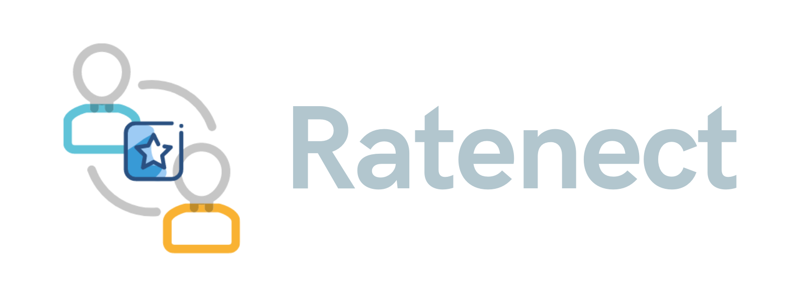

# Ratenect

<br><br> 
Ratenect is a web platfrom with a two-way rating system where the users can find NGOs near them and can apply to volunteer in-person for their public activities. Based on their experience the NGOs can rate the volunteers and vice-versa.
<br><br>
Read more details about the project inspiration [here](https://cbrtl.github.io/posts/ratenect/).


## Tech Stack
  - **Frontend**: React
  - **Backend**: Node js, Express js
  - **Database**: MongoDB (Atlas)


## Plan
  - **UI**: [Figma](https://www.figma.com/file/W7mgBV73gMNZRFjuEewyDN/ratenect?node-id=0%3A1)
  - **Database Schema**: [dbdiagram](https://dbdiagram.io/d/60f164684ed9be1c05cfa3bf)
 

 ## Run Project
 - Clone the repository
 - `cd` into the `ratenect-backend` folder
 - switch to dev branch `git checkout dev`
 - run `npm install`
 - run `npm install jsonwebtoken --save`
 - create a `.env` file in the root directory and paste the following data into it:
   ```
   PORT = 3000
   db_user = ******
   db_pwd = ******
   db_name = ******
   secret_key = ******
   ```
   **NOTE**: Use your own MongoDB Atlas for storing the data (suggested), else ask the project maintainers on [Discord](https://discord.com/invite/3qry3u569v) `#ratenect` channel for the DB connection credentials.

 - save the changes and run `npm start`
 - visit http://localhost:3000/ in your browser


 ## Contributing:

 1. Go through the [Contributing Guidelines]().
 2. Fork this repository and then clone the forked repository to your system.
 3. Create a new branch `<your-github-username>`.
 4. Switch to your new branch and add your github username to the `contributors.md` file.
 5. Commit the changes in your local system and `git push` to the upstream.
 6. Come back to ratenect's github page and make a pull request from `you:<your-branch>` to `cbrtl:dev`.
 7. Introduce yourself in the comment section of the first post on Discussions tab.


